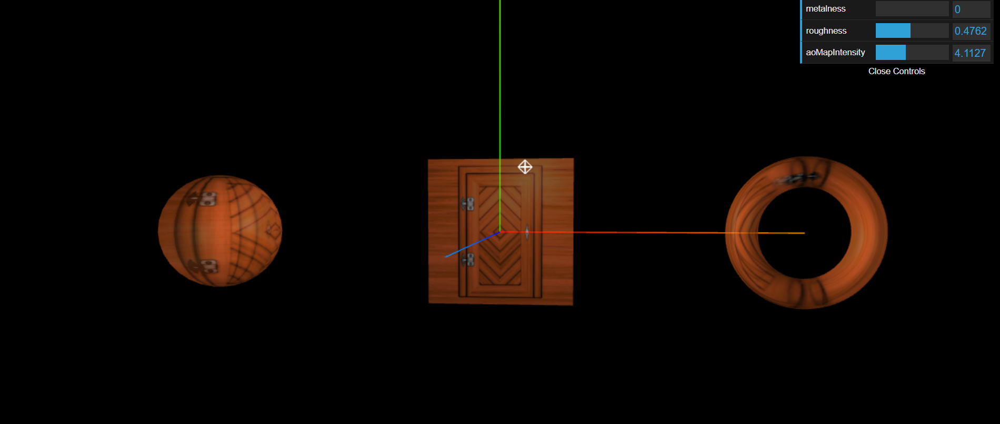

# 🧪 Three.js Scene with Texture, AO Map, and GUI Controls

This is a WebGL-powered 3D scene built using [Three.js](https://threejs.org/) and configured with basic lighting, orbit controls, GUI debugging tools, and texture mapping including **ambient occlusion**. It demonstrates how to use multiple geometries with shared material properties.

---

## 🚀 Features

- 🎨 Textured Sphere, Plane, and Torus
- 💡 Ambient & Point Lights with Helpers
- 🕹️ Interactive OrbitControls
- 🎛️ Real-time GUI controls using `dat.GUI`
- 🌗 Ambient Occlusion Mapping
- 🖼️ Double-sided, semi-transparent material
- 📐 Axis helper and grouped objects
- 🔄 Responsive to window resize

---

## 📁 Project Structure

```
your-project/
├── src/
│ ├── index.js # Main Three.js logic
│ ├── style.css # CSS styles
│ └── textures/
│ └── door/
│ ├── ambientOcclusion.jpg
│ └── color.jpg
├── dist/ # Built files (after bundling)
├── bundler/ # Webpack configuration files
├── package.json
└── README.md
```

## 🛠️ Getting Started

### 1. 📦 Install Dependencies

Make sure you have [Node.js](https://nodejs.org/) installed. Then run:

```bash
npm install
```

### 2. 🧪 Run Development Server

```bash
npm run dev
```

This will start the Webpack development server and open the scene in your browser.

---

## 🧱 Tech Stack

- [Three.js](https://threejs.org/) — 3D rendering
- [dat.GUI](https://github.com/dataarts/dat.gui) — UI for tweaking parameters
- [Webpack](https://webpack.js.org/) — Bundler

---

## 🖥️ What You’ll See

- A 3D **Sphere**, **Plane**, and **Torus** arranged in a group
- **Texture and ambient occlusion maps** applied to all objects
- GUI controls for:

  - `metalness`
  - `roughness`
  - `aoMapIntensity`

- Axis helper and point light helper
- Real-time updates and camera orbit interaction

---

## 📝 Notes

- Ensure the texture images (`ambientOcclusion.jpg` and `color.jpg`) are located under `src/textures/door/`.
- `uv2` coordinates are manually copied for ambient occlusion to work.
- The scene resizes automatically when the window size changes.

---

## 🧼 Build for Production

```bash
npm run build
```

This will output the optimized files into the `dist/` directory.

---

## 📸 Screenshot



---
