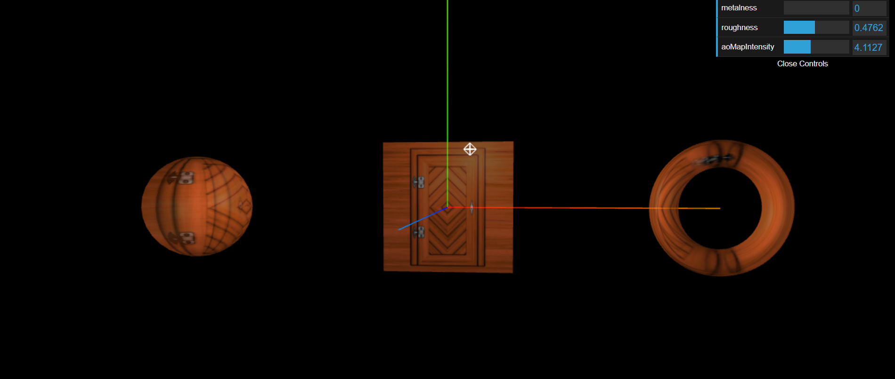

# 🧪 Three.js Multi-Map Material Scene with GUI

This project showcases a 3D scene built using [Three.js](https://threejs.org/) with **multiple texture maps** (including ambient occlusion, displacement, metalness, roughness, normal, and alpha maps) applied to geometries. It includes real-time tweaking via a GUI panel and camera controls using `OrbitControls`.

---

## 🚀 Features

- 🧱 Geometries: Sphere, Plane, and Torus
- 🖼️ Texture Mapping:
  - Color Map
  - Ambient Occlusion (AO) Map
  - Displacement (Height) Map
  - Metalness Map
  - Roughness Map
  - Normal Map
  - Alpha Map
- 🔧 `dat.GUI` control panel to tweak:
  - Metalness
  - Roughness
  - AO Intensity
  - Displacement Scale
- 🎥 Perspective camera with orbit controls
- 💡 Ambient and Point lighting with helpers
- 🎯 Responsive design with window resize support
- 🧭 Axis and PointLight helpers for debugging

---

## 📁 Project Structure

```
your-project/
├── src/
│ ├── index.js # Main Three.js logic
│ ├── style.css # CSS styles
│ ├── index.html # html
│
├──static
│ └── textures
│       └── door
│           ├── ambientOcclusion.jpg
│           ├── color.jpg
│           ├── height.jpg
│           ├── metalness.jpg
│           ├── roughness.jpg
│           ├── normal.jpg
│           └── alpha.jpg
├── dist/ # Built files (after bundling)
├── bundler/ # Webpack configuration files
├── package.json
└── README.md
```

## 🛠️ Getting Started

### 1. 📦 Install Dependencies

Make sure you have [Node.js](https://nodejs.org/) installed. Then run:

```bash
npm install
```

---

### 2. 🧪 Run Development Server

```bash
npm run dev
```

This will start the Webpack development server and open the scene in your browser.

---

## 🧱 Tech Stack

- [Three.js](https://threejs.org/) — 3D rendering
- [dat.GUI](https://github.com/dataarts/dat.gui) — UI for tweaking parameters
- [Webpack](https://webpack.js.org/) — Bundler

---

## 🖥️How It Works

- A 3D **Sphere**, **Plane**, and **Torus** arranged in a group
- **Texture and ambient occlusion maps** applied to all objects
- GUI controls for:

  - `metalness`
  - `roughness`
  - `aoMapIntensity`
  - `Dispalcement Intensity`

- Axis helper and point light helper
- Real-time updates and camera orbit interaction

---

## 📝 Notes

- Ensure the texture images (`ambientOcclusion.jpg` and `color.jpg`) are located under `src/textures/door/`.
- `uv2` coordinates are manually copied for ambient occlusion to work.
- The scene resizes automatically when the window size changes.

---

## 🧼 Build for Production

```bash
npm run build
```

This will output the optimized files into the `dist/` directory.

---

## 📸 Output Preview



---
